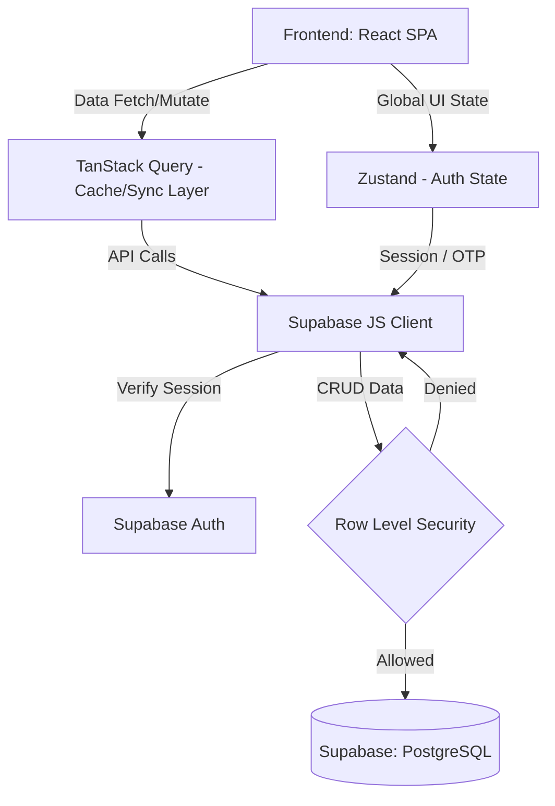

# Arsitektur Sistem MESO App

Dokumen ini memberikan gambaran menyeluruh (overview) mengenai arsitektur sistem dari aplikasi MESO (Monitoring Efek Samping Obat), termasuk arsitektur integrasi sistem, teknologi yang digunakan, serta pemetaan halaman (sitemap) secara detail.

---

## 1. Overview Sistem dan Tech Stack

MESO App adalah aplikasi berbasis *Single Page Application (SPA)* yang dirancang untuk memfasilitasi komunikasi, pemantauan, dan pelaporan efek samping obat bagi Pasien, Apoteker, dan Dokter.

### Teknologi Inti (Tech Stack)
- **Frontend Framework**: React 19 dengan TypeScript, berjalan di atas *build tool* Vite untuk performa *hot-module replacement* (HMR) dan *building* yang cepat.
- **Styling**: Tailwind CSS v4 digunakan sebagai *utility-first CSS framework*, digabungkan dengan `clsx` dan `tailwind-merge` untuk resolusi konflik kelas dinamis, serta Lucide React untuk ikon.
- **State Management**: 
  - **Zustand**: Mengelola *global state* ringan seperti status autentikasi (`useAuthStore`) dan preferensi UI.
  - **React Query (TanStack Query)**: Mengelola *server state*, *caching*, dan *data fetching* ke backend.
- **Routing**: React Router v7 (`react-router-dom`) untuk navigasi berbasis URL dan perlindungan rute (*protected routes*).
- **Backend / Database (BaaS)**: Supabase digunakan sebagai platform *Backend-as-a-Service*. Menyediakan database relasional (PostgreSQL), sistem Autentikasi, dan *Row Level Security* (RLS).
- **Visualisasi Data**: Recharts digunakan untuk merender grafik pemantauan kesehatan pasien.

---

## 2. Arsitektur Terintegrasi (System Architecture)

Sistem MESO App menggunakan pendekatan **Client-BaaS Architecture** (Client ke Backend-as-a-Service).

### Komponen Utama:
1. **Client Layer (React)**: Menyajikan UI, memvalidasi form secara lokal, menangani aksi pengguna, dan merender visualisasi data. Komponen dipecah dalam struktur modular (`src/features/*`).
2. **Data Sync Layer (React Query)**: Berada di antara komponen UI dan Supabase Client. Bertugas melakukan caching data, me-request ulang (refetch) secara otomatis jika data usang (stale), dan mengelola state loading/error secara deklaratif.
3. **Integration Layer (Supabase Client)**: Menggunakan library `@supabase/supabase-js`. Komunikasi dilakukan secara *direct* dari frontend ke Supabase via REST API atau WebSocket (untuk fitur real-time seperti Chat jika diaktifkan).
4. **Security Layer (Supabase RLS)**: Sebagai proteksi di level database, *Row Level Security* (RLS) pada PostgreSQL memastikan operasi CRUD hanya dilakukan pada baris data yang diizinkan sesuai dengan Role JWT *user* saat itu (contoh: Pasien A tidak bisa melihat laporan Pasien B).
5. **Autentikasi**: Mengkombinasikan metode Email/Password bawaan Supabase dan integrasi OTP khusus (seperti Telegram OTP/Fonnte) melalui arsitektur trigger di database (`setup_telegram_otp.sql`, `setup_otp.sql`).

---

## 3. Sitemap dan Konfigurasi Routing

Sistem routing dikonfigurasikan secara terpusat di `src/configs/routes.config.ts` dan diimplementasikan pada `src/app/AppRouter.tsx`. Routing menggunakan *Code Splitting* (`React.lazy`) agar ukuran *bundle* lebih optimal.

Setiap *route* dikelompokkan berdasarkan **Role Pengguna** yang dijaga oleh `<ProtectedRoute>`.

### A. Public Routes (Tidak Membutuhkan Login)
Digunakan untuk fase *onboarding* dan recovery akun.
- `/login` : Halaman Autentikasi (Input Email/Password & OTP).
- `/register` : Halaman pendaftaran mandiri (biasanya untuk pasien).
- `/forgot-password` : Halaman inisiasi reset password.
- `/reset-password` : Halaman pembuatan password baru.
- `/privacy` : Informasi Kebijakan Privasi.
- `/deactivated` : Halaman status ketika akun pasien telah di-nonaktifkan oleh admin/sistem.

### B. Patient Routes (Hak Akses: `patient`)
Area khusus pasien untuk melaporkan kondisinya dan berkomunikasi.
- `/patient/dashboard` : Halaman utama pasien (ringkasan kondisi dan jadwal terbaru).
- `/patient/report/new` : Form pengisian laporan efek samping obat mandiri.
- `/patient/history` : Riwayat pelaporan efek samping yang pernah dilakukan.
- `/patient/education` : Modul atau daftar bacaan edukasi yang dikirimkan oleh apoteker.
- `/patient/schedule` : Jadwal temu, kontrol, atau jadwal intervensi.
- `/patient/chat` : Antarmuka komunikasi teks secara aman dengan apoteker.
- `/patient/profile` : Halaman manajemen data diri dan password.

### C. Pharmacist Routes (Hak Akses: `pharmacist`, `admin`)
Area kerja untuk Apoteker memonitor semua pasien yang ditugaskan.
- `/pharma/dashboard` : Panel statistik (tren gejala, pasien aktif).
- `/pharma/queue` : Antrean laporan efek samping pasien yang perlu ditindaklanjuti.
- `/pharma/report/new` : Form pembuatan laporan efek samping proaktif oleh apoteker.
- `/pharma/report/:id` : Detail spesifik mengenai satu laporan efek samping.
- `/pharma/chat` : Halaman komunikasi (inbox) sentral untuk menjawab pesan dari berbagai pasien.
- `/pharma/patients` : Daftar manajemen seluruh pasien (*directory*).
- `/pharma/patient/:id/:reportId?` : Pemantauan detail satu pasien tertentu beserta riwayat laporannya.
- `/pharma/education` : *Content Management System* mini untuk mengunggah dan mendistribusikan materi edukasi.
- `/pharma/schedule` : Manajemen penjadwalan kontrol dan intervensi pasien.
- `/pharma/help` : Panduan operasional apoteker.
- `/pharma/settings` : Pengaturan sistem dan preferensi profil apoteker.

### D. Doctor Routes (Hak Akses: `doctor`, `admin`)
Area pemantauan level lanjut untuk tenaga medis (Dokter).
- `/doctor/watchlist` : Daftar pasien yang memerlukan pemantauan intensif atau pasien yang telah di-*escalate* dari apoteker.
- `/doctor/patient/:id/:reportId?` : Peninjauan medis dan klinis spesifik pasien (termasuk status vital dan grade gejala).
- `/doctor/history` : Riwayat pelaporan secara keseluruhan.

---

## 4. Pola Alur Data (Data Flow Patterns)

Sebagai contoh kasus, berikut adalah alur ketika Apoteker membuat laporan baru untuk pasien:

1. **User Action**: Apoteker membuka rute `/pharma/report/new` dan mengisi form pelaporan terstruktur (vitals, symptoms grade).
2. **State Management**: Form divalidasi di Frontend. Setelah valid, fungsi *mutation* dari React Query dipanggil.
3. **Network Request**: Supabase JS Client mengirim *payload* POST (Insert) ke endpoint REST yang otomatis disediakan oleh Supabase berdasarkan tabel `reports`. Request ini membawa *Bearer Token (JWT)* apoteker.
4. **Database Execution**: 
   - Supabase meninjau *Row Level Security* (RLS) di tabel `reports`. Karena role JWT adalah `pharmacist`, *Policy* mengizinkan operasi *Insert*.
   - Data tersimpan di PostgreSQL.
5. **Response & Cache Update**:
   - Supabase membalas dengan status 2xx.
   - React Query otomatis me-*invalidate* cache terkait laporan (`queryClient.invalidateQueries(['reports'])`).
   - UI di Dashboard dan *Patients list* apoteker diperbarui tanpa perlu memuat ulang halaman (*seamless update*).
