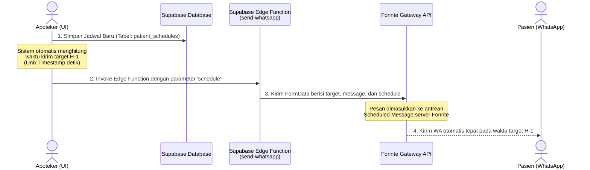

# Dokumentasi Sistem WhatsApp Auto-Reminder H-1 via Fonnte Scheduled API

Sistem WhatsApp Auto-Reminder dirancang untuk memberikan pengingat otomatis (automagic) kepada pasien terkait jadwal kontrol, kemoterapi, atau janji temu medis lainnya yang dijadwalkan oleh apoteker. Sistem ini berjalan di latar belakang (background) memanfaatkan **Fonnte Scheduled Message API** sehingga tidak memerlukan tindakan manual atau pengiriman berulang dari apoteker setiap harinya.

---

## 🏗️ Arsitektur & Alur Data (Data Flow)

Berikut adalah alur perjalanan pengiriman pesan pengingat otomatis sejak janji temu dibuat:



---

## ⚙️ Detail Komponen Teknis

### 1. Database & Schema Extension (Supabase & TypeScript)
*   **Query Seleksi Pasien:** Untuk mengirim pengingat otomatis, frontend memerlukan nomor telepon pasien aktif saat jadwal dibuat. Kolom `phone_number` ditarik secara aman dari tabel `profiles` melalui hook [usePatientDirectory](file:///d:/MESO-app/src/features/reports/api/usePatientDirectory.ts).
*   **Pemetaan Data:** Data `phone_number` dipetakan secara terstruktur dalam [reportMapper.ts](file:///d:/MESO-app/src/features/reports/utils/reportMapper.ts) ke properti `phoneNumber` pada antarmuka [PatientDirectoryItem](file:///d:/MESO-app/src/features/reports/types.ts).

### 2. Supabase Edge Function: `send-whatsapp`
Berkas: [supabase/functions/send-whatsapp/index.ts](file:///d:/MESO-app/supabase/functions/send-whatsapp/index.ts)
Edge Function bertindak sebagai gerbang aman (secure proxy) untuk menyembunyikan API token Fonnte dari browser. Berkas ini telah ditingkatkan untuk mendukung pengiriman terjadwal:
```typescript
const { target, message, schedule } = await req.json()
...
const form = new FormData()
form.append('target', cleanTarget)
form.append('message', message)
form.append('countryCode', '62')
if (schedule) {
  form.append('schedule', String(schedule)) // Meneruskan Unix Timestamp ke Fonnte
}
```

### 3. Fonnte Service Frontend
Berkas: [src/services/fonnte.service.ts](file:///d:/MESO-app/src/services/fonnte.service.ts)
Layanan frontend ini bertanggung jawab mengirimkan data payload ke Edge Function dan memformat pesan secara seragam:
```typescript
export interface WAOptions {
  target: string    
  message: string   
  delay?: number    
  schedule?: number // Unix Timestamp dalam satuan detik
}
```

---

## 🧠 Logika Kalkulasi & Penanganan Kasus Khusus (Failsafe)

Pemicu utama otomatisasi ini disematkan langsung pada penanganan pembuatan jadwal (`handleCreateSchedule`) di dalam [PharmacistSchedule.tsx](file:///d:/MESO-app/src/features/reports/pages/PharmacistSchedule.tsx).

### A. Perhitungan Waktu Pengiriman Terjadwal
Sistem menghitung waktu pengiriman dengan prioritas sebagai berikut:
1.  **Skenario Normal (H-1):**
    Sistem menghitung target waktu pengiriman tepat **24 jam sebelum waktu janji temu** dimulai.
    $$\text{Target Waktu} = \text{Waktu Janji Temu} - 24 \text{ jam}$$
2.  **Skenario Khusus (Fallback Janji Mendadak):**
    Jika jadwal kontrol dibuat mendadak (misalnya janji temu dijadwalkan untuk hari ini atau besok pagi, sehingga waktu H-1 di atas sudah terlewat di masa lalu), sistem secara cerdas mengatur target waktu pengiriman tepat **5 menit dari sekarang** agar pasien tetap mendapatkan pesan pemberitahuan awal sebagai pesan konfirmasi instan.

### B. Perlindungan Kesalahan (Failsafe Wrapper)
Proses penjadwalan pesan WA dibungkus dengan blok `try-catch` terpisah (independen) dari mutasi penyimpanan database. Ini memastikan bahwa jika terjadi kegagalan eksternal (misal kuota Fonnte habis, token belum dikonfigurasi, atau kegagalan jaringan luar), **jadwal janji temu pasien tetap berhasil disimpan di database utama** dan apoteker akan mendapatkan pesan peringatan tanpa menghentikan alur aplikasi.

---

## 📝 Format Pesan Pengingat Otomatis

Template pesan diformat secara elegan dengan elemen penekanan (bolding) dan emoji penarik perhatian agar mudah dibaca pasien:

```text
Halo Ibu/Bapak *[Nama Pasien]*,

Kami dari tim *Sahabat Pejuang* ingin mengingatkan jadwal *[Judul Kegiatan]* Anda pada:

🗓️ Tanggal: *[Hari, Tanggal Bulan Tahun]*
⏰ Jam: *[Jam:Menit]*

Mohon hadir tepat waktu. Jika ada kendala, silakan hubungi kami melalui fitur chat di aplikasi. Terima kasih.
```

---

## 🧪 Cara Verifikasi & Troubleshooting

1.  **Periksa Status Antrean di Fonnte:**
    Buka dashboard resmi Anda di [Fonnte](https://fonnte.com), lalu navigasikan ke menu **Scheduled Messages**. Ketika jadwal baru berhasil ditambahkan di aplikasi MESO, pesan pengingat baru harus muncul di sana dengan status antrean sesuai dengan tanggal target pengiriman H-1 yang telah dikalkulasi.
2.  **Periksa Token Fonnte di Supabase Edge Function:**
    Pastikan `FONNTE_TOKEN` telah diatur dengan benar pada environment variable Supabase Anda:
    ```bash
    supabase secrets set FONNTE_TOKEN=your_token_here
    ```
